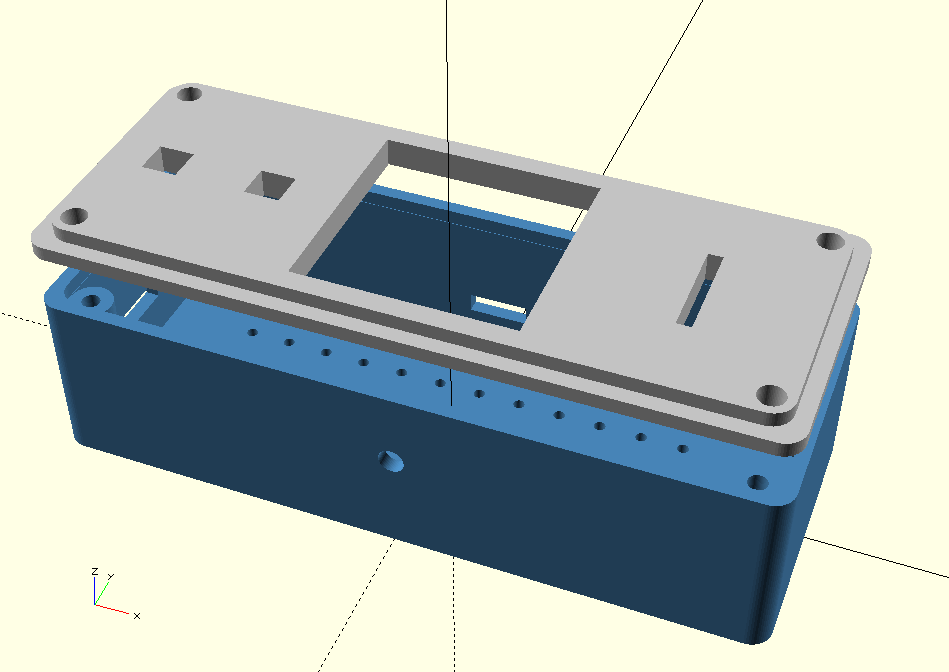

                           BILL OF MATERIALS 

 REF    | COMPONENTES      | ESPECIFICACIONES           | QTY 
--------|------------------|----------------------------|------------
 ES     | Microcontrolador | ESP8266 (Generic)          | 1
 LO     | LoRa Module      | SX1276 (868 MHz)           | 1
 OLD    | OLED Display     | Monochromatic I2C (4-pin)  | 1
 PR     | Push Buttons     | Generic Tactile            | 2
 PTR    | Potentiometer    | Generic Analog             | 1
 PWR    | Power Source     | 3.2V LiPo Battery          | 1

 

* Nota: El proyecto utiliza placas genéricas para el microcontrolador y la pantalla,
  usar otra placa diferente no debería suponer un problema, en caso de error,
  consulta el manual y especificaciones de la placa, probablemente se deberá a una distinta
  distribución de pines.

